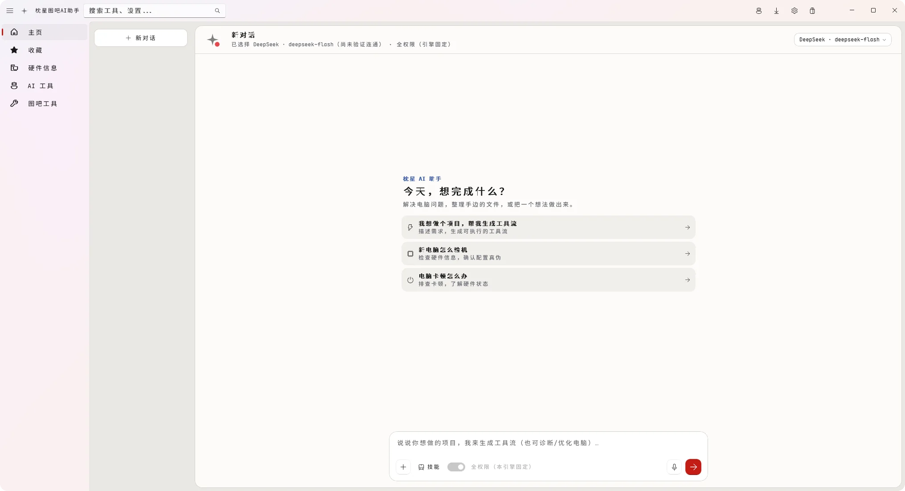

# 枕星图吧AI助手

**说出想完成的事，把目标变成可执行的下一步。**

枕星图吧AI助手是面向 Windows 的 AI 助手与电脑工具工作台。它帮助你明确目标、比较可用方案、复用本机软件、准备必要工具，再交接给选定的软件或 AI Agent。硬件信息、电脑工具、技能库、资讯和社区围绕这条使用路径展开。

当前公开版本：**V0.1 · r10 公开预览版**，2026 年 10 月 5 日发布，采用 **WinUI 3 / .NET 10**，提供 **Windows x64 便携包**。

[**官网下载 r10 完整包**](https://zhenxingai.com/downloads/ZhenxingAI-v0.1-workbench-preview-20261005-r10.zip) · [GitHub 备用下载](https://github.com/yujinchuan2021-max/zhenxing-ai-assistant/releases/tag/v0.1.0-preview-r10) · [新版使用指南](docs/getting-started.md) · [常见问题](docs/faq.md) · [更新说明](docs/releases/r10.md)

[官网](https://zhenxingai.com/) · [枕星AI资讯](https://zhenxingai.com/ai-news/) · [枕星AI社区](https://community.zhenxingai.com/) · [反馈问题](https://github.com/yujinchuan2021-max/zhenxing-ai-assistant/issues)

*客户端实拍界面示例。截图记录的是此前的首页布局，具体入口、文案和功能状态以当前 r10 为准。*

## 用一个目标开始

你可以直接说“我想在 Windows 上做一款 2D 游戏”“帮我选择 AI 生成音乐的方案”或“电脑卡顿，帮我排查”。助手先处理会影响下一步的关键条件，有明确答案范围时提供可点击选项；已经确认的信息继续沿用。

| 你想做的事 | 枕星帮助准备什么 | 接下来在哪里完成 |
| --- | --- | --- |
| 在 Windows 做一款 2D 游戏 | 比较符合预算、账号与平台条件的 Agent、模型接入和游戏引擎，复用已装软件，准备必要环境与打开入口。 | 在选定 Agent 和引擎中继续开发、运行与导出，工作台保留准备进度和下一步。 |
| 用 AI 生成音乐或其他创作内容 | 按所需结果选择生成服务，核对必要的账号与使用条件，给出服务入口；没有后期需求时不额外安排专业制作工具。 | 在选定服务里生成、调整并取得结果；枕星协助选型与上手，不把工具准备当成作品交付。 |
| 新电脑验机或排查电脑卡顿 | 读取硬件信息、选择检查与测试工具，准备需要下载的软件并提供启动方式。 | 在具体检查或测试工具中核对结果，结合实际现象继续排查；检测记录供后续判断。 |

任务工作台按四步组织过程：**明确目标 → 选择方案 → 准备工具 → 开始使用**。开发类目标比较 Agent、模型接入与开发环境，普通用户优先考虑符合条件的桌面方案；生成音乐、图片等目标按实际成果选服务，不默认加上一整套专业制作软件。

工具准备完成后，工作台给出打开入口和下一步说明。制作作品、编写项目或运行业务的后续工作在选定工具中继续，**“环境已准备”与“目标已完成”分别呈现**。

## 系统与使用条件

| 项目 | 当前版本说明 |
| --- | --- |
| Windows | 工程最低目标为 Windows 10 2004（build 19041）；开发与验证以 Windows 11 为主，工程最低版本不代表所有系统版本均已实际验收。 |
| 系统架构 | 当前仅发布 Windows x64 便携包，本轮未提供 x86 或 ARM64 包。 |
| 网页组件 | 资讯、社区等网页入口使用 WebView2，需要可用的 WebView2 运行环境及对应网站的网络连接。 |
| AI 功能 | 可按个人需要配置模型 API 或兼容本地服务；本地模型能否运行取决于具体模型与硬件。未配置 AI 时仍可使用不依赖模型的本机和公开内容功能。 |
| 系统权限 | 部分系统与硬件功能需要管理员权限，运行时按 Windows 提示操作。 |

## 第一次使用

1. 下载 ZIP，**完整解压到一个新文件夹**，运行根目录 **`枕星图吧AI助手.exe`**。不要直接在压缩包里运行，也不要只复制启动文件。部分电脑工具需要管理员权限，启动时可能出现 Windows 授权提示。
2. 使用 AI 功能前，到 **“设置 → AI 与 Agent”** 配置服务地址、模型和凭据，按页面提示测试连接。客户端内的 AI 相关功能复用这份全局配置。
3. 回到首页描述目标，回答必要选项，比较方案，再确认准备清单。符合当前需要的已安装软件优先复用。
4. 准备完成后，从任务工作台或应用中心打开工具。支持的桌面软件会尝试创建桌面快捷方式；CLI 会提供终端使用说明和启动命令。

**还没有 AI 接口也能使用本机工具、应用中心和公开技能目录，并阅读服务器已更新的 AI 资讯。** 对话、AI 技能制作和个人资讯整理等模型功能需要可用的 AI 配置。外部 Agent 的账号、订阅和模型接入仍由相应产品决定，客户端的一次配置不会自动登录第三方软件。

**升级到 r10 请完整下载并解压到新文件夹。** R1 到 R10 使用相同的程序版本号，旧预览客户端的“已是最新版本”不能判断是否已安装 r10；本版也不会自动替换和重启。官网下载与 GitHub 原包具有相同的大小和 SHA-256。升级前保留原数据目录；使用应用目录或自定义路径保存数据时，还需保留位置标记，步骤见 [升级说明](docs/getting-started.md#升级与反馈)。

## 新版有哪些入口

| 入口 | 可以做什么 | 使用时看什么 |
| --- | --- | --- |
| 首页与任务工作台 | 描述目标、点击选项、比较方案、跟踪准备进度、接续下一步。 | 当前目标、当前步骤和实际回执，避免把安装成功当成作品完成。 |
| 应用中心 | 管理本机检测结果、登记的软件和下载任务；提供打开、位置、快捷方式、移除记录及支持的卸载入口。 | 登记记录与本机实际状态分开；“移除记录”不会卸载软件。 |
| 硬件信息与电脑工具 | 查看配置、排查电脑问题、进行性能测试；内置系统功能直接使用，第三方软件按需下载。 | 软件来源、所需权限和具体工具的可用状态。 |
| 性能测试与排行榜 | 运行测试、查看或导出报告、主动投稿到枕星服务，并查看审核后的公开成绩。 | 投稿须主动确认；审核采纳不等于独立验证测量结果。 |
| 官方技能库 | 分类浏览、全库搜索、查看说明与来源；瀑布流预加载前两页，继续滚动加载更多。 | 当前加载数量与目录总量分开；来源、许可及本机加载条件。 |
| 技能修改与制作 | 编辑内置目标技能，或让已配置的 AI 引导制作新技能；本机保存、加载、试用，再主动投稿。 | 本机试用与服务器审核是两种状态；提交不等于立即上架。 |
| 枕星AI资讯 | 阅读官方更新、来源信息与原文；客户端可用个人 AI 配置做额外摘要和精选。 | 官方资讯服务默认每天北京时间 09:00 更新，失败时保留有效缓存。 |
| 枕星AI社区 | 在内置浏览器交流目标、工具流、教程和问题反馈。 | 社区账号独立；特殊登录方式可能需要从外部浏览器重新登录。 |

模型推荐结合目标能力、预算、账号、网络、平台和硬件条件，不把固定品牌或某个旧型号当作永久推荐。选本地模型时需要先核对设备能否运行；桌面版、CLI、国内版和国际版也分别核对。

## r10 修复了什么

r10 重点处理社区注册、登录时的“授权超时或您已切换浏览器”：受支持的官方身份授权在同一个内置浏览器会话里继续，保留原始表单提交；失败、超时、离开与重试分别处理。需要浏览器完成的特殊登录方式会给出清楚的重新登录入口，浏览器中的登录仅对该浏览器生效。

公开源码重新构建通过，**207 项社区相关逻辑测试全部通过**；2 项原生隔离授权功能用例和 8 项离线运行时检查通过。原生验证宿主退出仍出现微信输入法模块异常，真实账号注册和登录尚未验证，因此继续标识为预览版。完整范围、已知限制和下载校验值见 [r10 更新说明](docs/releases/r10.md)。

发布包提供 SHA-256 校验和对应标签源码。r10 的本项目启动器、主客户端与后端程序尚未提供数字签名；第三方认证与推荐将以本项目独立取得的结果为准，说明见 [常见问题](docs/faq.md#当前版本有代码签名或第三方认证吗)。

## 数据与隐私

模型请求发送到你配置的服务。API Key 使用 Windows 当前用户的数据保护机制保存在本机。资讯、社区、搜索、下载和主动上传等功能也会联网。

**工具流分享默认开启，可以在设置中关闭。** 最终选定方案后，客户端可向枕星服务器发送目标、完整方案、该会话的完整可见对话及相关执行结果和汇总计数。关闭后不再发起新的分享上传，关闭期间的记录不会在重开时补传；已到达服务器的记录不会因关闭而删除。技能投稿和跑分投稿需另外主动提交。详见 [隐私说明](PrivacyPolicy.txt)。

反馈时请附版本号、系统版本、最后一次操作、复现步骤与脱敏截图，不要公开密码、API Key、授权链接或完整敏感日志。

## 源码与参与

本项目基于 [图吧工具箱 CE / TubaWinUi3](https://github.com/luolangaga/tubatools) 继续开发，是独立的衍生版本，保留上游来源与署名。当前默认分支提供 WinUI 3 实现；历史 Electron 提交和标签保留，其安装包及自动更新机制属于历史版本。

- [源码构建与验证说明](docs/build.md)
- [贡献指南](CONTRIBUTING.md)
- [安全反馈说明](SECURITY.md)
- [GitHub Issues](https://github.com/yujinchuan2021-max/zhenxing-ai-assistant/issues)

当前源码依据 [GNU GPL v3.0](LICENSE) 发布。第三方字体、图标、运行时与工具遵循各自许可，详见 [NOTICE](NOTICE) 和 [随包许可说明](License.txt)。源码仓库不包含完整第三方工具集合、个人运行环境、用户数据或服务器密钥。
